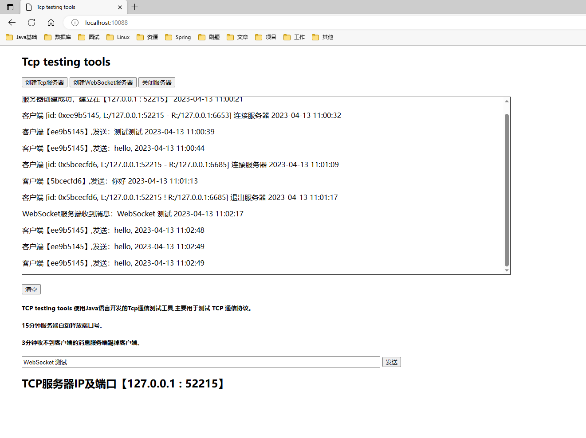

# Tcp testing tools
 TCP testing tools 使用Java语言开发的Tcp通信测试工具,主要用于测试 TCP 通信协议。

15分钟服务端自动释放端口号.

3分钟收不到客户端的消息服务端踢掉客户端.

>PS：由于用到Redis过期事件,需要先修改Redis配置文件，redis.conf -> **notify-keyspace-events Ex**
否则过期事件不生效

>如果要部署的云服务器，请修改application.yaml 配置文件,以及main.js的 ip，以及 localServerPort
